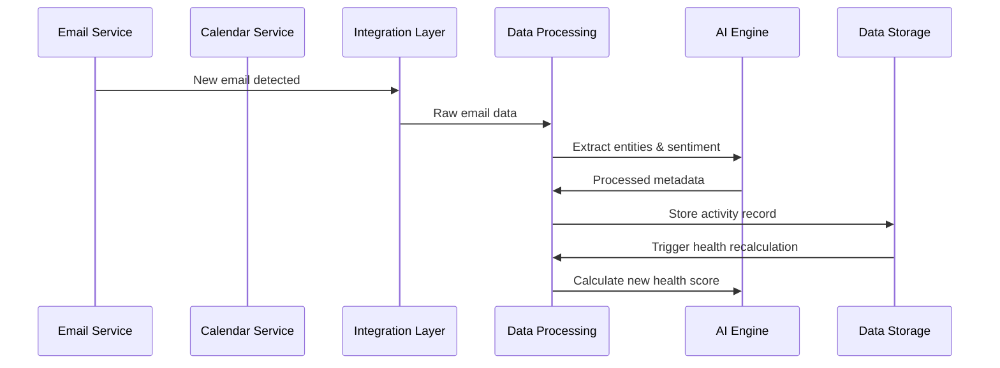
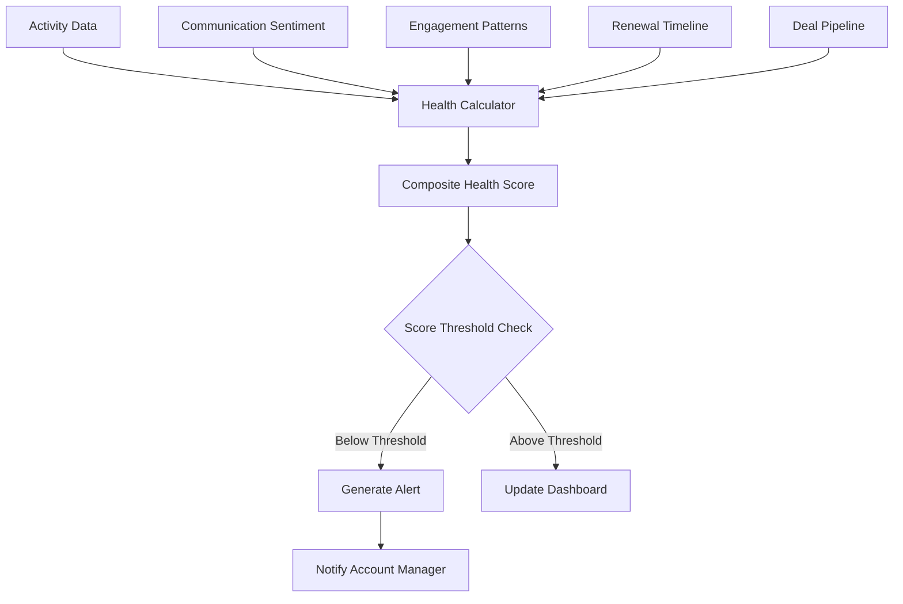
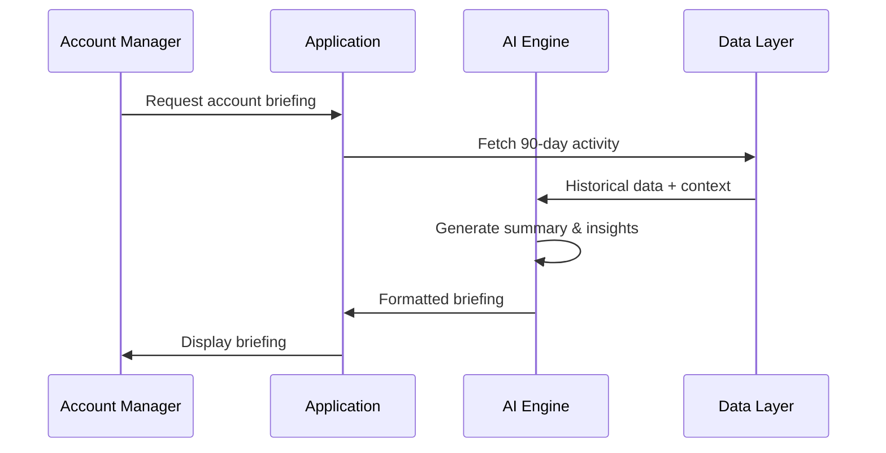

# CRM System Technical Specification

## Executive Summary

This document outlines the technical architecture for a relationship-centric CRM system designed to shift from transactional thinking to relationship health management. The system emphasizes automated data capture, AI-powered insights, and proactive relationship management for Black Pear's software company.

## System Overview

### Core Philosophy
The system treats accounts as "living organisms" rather than static database entries, with continuous health monitoring, automated context generation, and intelligent action recommendations.

## System Architecture

### High-Level Architecture

```
┌─────────────────┐    ┌─────────────────┐    ┌─────────────────┐
│   Presentation  │    │   Intelligence  │    │   Integration   │
│      Layer      │◄──►│     Layer       │◄──►│     Layer       │
└─────────────────┘    └─────────────────┘    └─────────────────┘
         │                        │                        │
         ▼                        ▼                        ▼
┌─────────────────┐    ┌─────────────────┐    ┌─────────────────┐
│   Application   │    │   Analytics &   │    │   External      │
│     Layer       │◄──►│   AI Engine     │◄──►│   Services      │
└─────────────────┘    └─────────────────┘    └─────────────────┘
         │                        │                        │
         ▼                        ▼                        ▼
┌─────────────────┐    ┌─────────────────┐    ┌─────────────────┐
│   Data Access   │    │   Event Stream  │    │   Data Storage  │
│     Layer       │◄──►│     Layer       │◄──►│     Layer       │
└─────────────────┘    └─────────────────┘    └─────────────────┘
```

### System Components

#### 1. Core Application Services

**Account Management Service**
- Account lifecycle management
- Health score calculation and tracking
- Relationship mapping and analysis
- Account hierarchy management

**Contact Intelligence Service**
- Contact role identification and influence mapping
- Relationship gap analysis
- Champion/blocker identification
- Executive relationship tracking

**Activity Intelligence Service**
- Automated activity capture and processing
- Timeline generation and management
- Context extraction and categorization
- Activity pattern analysis

**Alert & Notification Service**
- Health score monitoring and alerting
- Proactive action recommendations
- Follow-up reminders and escalations
- Threshold-based notifications

#### 2. AI & Analytics Engine

**Health Score Calculator**
- Multi-factor health scoring algorithm
- Engagement frequency analysis
- Sentiment analysis integration
- Renewal risk assessment
- Deal momentum tracking

**AI Briefing Generator**
- Context summarization for account handoffs
- Pre-meeting preparation summaries
- 90-day activity briefs
- Decision and commitment extraction

**Predictive Analytics Engine**
- Churn prediction modeling
- Renewal likelihood scoring
- Relationship degradation detection
- Optimal engagement timing

#### 3. Integration Layer

**Email Integration Service**
- Gmail/Outlook API integration
- Automatic email activity capture
- Sentiment analysis of communications
- Contact extraction and matching

**Calendar Integration Service**
- Calendar API integration (Google/Outlook)
- Meeting auto-logging
- Pre-meeting context preparation
- Scheduling pattern analysis

**Communication Hub**
- Slack/Teams integration for notifications
- Unified communication timeline
- Cross-platform activity correlation

#### 4. Data Management Layer

**Event Sourcing System**
- All account interactions as events
- Immutable activity timeline
- State reconstruction capabilities
- Audit trail maintenance

**Data Processing Pipeline**
- Real-time activity ingestion
- Data validation and enrichment
- Duplicate detection and merging
- Data quality monitoring

## Data Models

### Core Entities

```typescript
// Account Entity
interface Account {
  id: string;
  name: string;
  industry: string;
  size: 'startup' | 'sme' | 'enterprise';
  healthScore: number;
  healthTrend: 'improving' | 'stable' | 'declining';
  tier: 'strategic' | 'key' | 'standard';
  assignedManager: string;
  createdAt: Date;
  updatedAt: Date;
  
  // Relationship data
  contacts: Contact[];
  activities: Activity[];
  decisions: Decision[];
  healthHistory: HealthScore[];
  influenceMap: InfluenceMap;
}

// Contact Entity
interface Contact {
  id: string;
  accountId: string;
  name: string;
  email: string;
  role: string;
  department: string;
  seniority: 'individual' | 'manager' | 'director' | 'vp' | 'c-level';
  influenceLevel: number; // 1-10
  championStatus: 'champion' | 'neutral' | 'blocker' | 'unknown';
  lastInteraction: Date;
  relationshipStrength: number; // 1-10
  communicationPreference: string[];
}

// Activity Entity
interface Activity {
  id: string;
  accountId: string;
  type: 'email' | 'meeting' | 'call' | 'proposal' | 'contract';
  title: string;
  description: string;
  participants: string[];
  timestamp: Date;
  sentiment: 'positive' | 'neutral' | 'negative';
  isPinned: boolean;
  source: 'manual' | 'email_sync' | 'calendar_sync';
  metadata: Record<string, any>;
}

// Health Score Entity
interface HealthScore {
  accountId: string;
  score: number;
  timestamp: Date;
  factors: {
    engagementFrequency: number;
    sentimentScore: number;
    renewalProximity: number;
    dealMomentum: number;
    relationshipDepth: number;
  };
  alerts: Alert[];
}

// Decision/Commitment Entity
interface Decision {
  id: string;
  accountId: string;
  title: string;
  description: string;
  decisionMaker: string;
  status: 'pending' | 'approved' | 'rejected';
  dueDate: Date;
  importance: 'low' | 'medium' | 'high' | 'critical';
  isPinned: boolean;
  createdAt: Date;
}

// Alert Entity
interface Alert {
  id: string;
  accountId: string;
  type: 'health_decline' | 'no_activity' | 'follow_up_needed' | 'renewal_risk';
  severity: 'low' | 'medium' | 'high' | 'critical';
  title: string;
  message: string;
  actionRequired: string;
  dueDate: Date;
  status: 'active' | 'acknowledged' | 'resolved';
  createdAt: Date;
}
```

## Data Flows

### 1. Automated Activity Capture Flow



### 2. Health Score Calculation Flow



### 3. AI Briefing Generation Flow



## Integration Points

### External System Integrations

**Email Providers**
- Gmail API for Google Workspace
- Microsoft Graph API for Outlook
- Real-time webhook integration for immediate activity capture
- OAuth 2.0 authentication

**Calendar Systems**
- Google Calendar API
- Microsoft Calendar API
- Automatic meeting detection and logging
- Pre-meeting context preparation

**Communication Platforms**
- Slack API for notifications and bot interactions
- Microsoft Teams integration
- Alert delivery and status updates

**AI/ML Services**
- OpenAI API for text summarization and analysis
- Azure Cognitive Services for sentiment analysis
- Custom ML models for health scoring

### API Design

**REST API Structure**
```
/api/v1/
├── accounts/
│   ├── GET    /accounts              # List accounts with health scores
│   ├── GET    /accounts/{id}         # Account details
│   ├── POST   /accounts              # Create account
│   ├── PUT    /accounts/{id}         # Update account
│   ├── GET    /accounts/{id}/health  # Health score history
│   └── GET    /accounts/{id}/brief   # AI-generated briefing
├── contacts/
│   ├── GET    /contacts              # List contacts
│   ├── POST   /contacts              # Create contact
│   ├── PUT    /contacts/{id}         # Update contact
│   └── GET    /contacts/{id}/influence # Influence mapping
├── activities/
│   ├── GET    /activities            # Activity timeline
│   ├── POST   /activities            # Manual activity entry
│   └── PUT    /activities/{id}/pin   # Pin/unpin activity
├── alerts/
│   ├── GET    /alerts                # Active alerts
│   ├── PUT    /alerts/{id}/acknowledge # Acknowledge alert
│   └── DELETE /alerts/{id}           # Dismiss alert
└── analytics/
    ├── GET    /analytics/health      # Health trends
    ├── GET    /analytics/engagement  # Engagement patterns
    └── GET    /analytics/reports     # Custom reports
```

**WebSocket Events**
```typescript
// Real-time events
interface WebSocketEvents {
  'health_score_updated': { accountId: string; newScore: number };
  'new_alert': Alert;
  'activity_captured': Activity;
  'briefing_ready': { accountId: string; briefingId: string };
}
```

## Technical Constraints and Considerations

### Performance Requirements
- Health score calculations must complete within 2 seconds
- Dashboard loading time under 3 seconds
- Real-time activity capture with <30 second latency
- Support for 500+ concurrent users

### Security Considerations
- OAuth 2.0 + PKCE for external integrations
- Role-based access control (RBAC)
- Data encryption at rest and in transit
- GDPR compliance for contact data
- Audit logging for all data access

### Scalability Design
- Microservices architecture for independent scaling
- Event-driven architecture for loose coupling
- Horizontal scaling for AI processing workloads
- Database sharding by account for large datasets

### Data Quality & Reliability
- Duplicate detection algorithms for contact merging
- Data validation pipelines
- Fallback mechanisms for failed integrations
- Data backup and recovery procedures

## Technology Stack Recommendations

### Backend Services
- **Runtime**: Node.js with TypeScript
- **API Framework**: Express.js with OpenAPI documentation
- **Database**: PostgreSQL for transactional data, ClickHouse for analytics
- **Cache**: Redis for session management and real-time data
- **Message Queue**: Apache Kafka for event streaming
- **Search**: Elasticsearch for activity search and analytics

### AI/ML Stack
- **ML Platform**: Python with scikit-learn for custom models
- **NLP**: OpenAI API for summarization, spaCy for entity extraction
- **Vector Database**: Pinecone for semantic search
- **Model Serving**: TensorFlow Serving for custom health score models

### Frontend
- **Framework**: React with TypeScript
- **State Management**: Redux Toolkit + RTK Query
- **UI Components**: Material-UI or Ant Design
- **Data Visualization**: D3.js or Recharts for health score charts
- **Real-time**: Socket.io client for live updates

### Infrastructure
- **Containerization**: Docker with Kubernetes orchestration
- **Cloud Provider**: AWS with managed services
  - EKS for container orchestration
  - RDS for PostgreSQL
  - ElastiCache for Redis
  - Lambda for serverless processing
- **Monitoring**: Prometheus + Grafana
- **Logging**: ELK Stack (Elasticsearch, Logstash, Kibana)

### Integration & API Management
- **API Gateway**: Kong or AWS API Gateway
- **Webhook Processing**: Serverless functions (AWS Lambda)
- **Rate Limiting**: Redis-based sliding window
- **Circuit Breaker**: Hystrix pattern implementation

## Implementation Phases

### Phase 1: Core Foundation (Weeks 1-4)
- Account and contact management
- Basic activity capture (manual entry)
- Simple health scoring
- Dashboard framework

### Phase 2: Automation (Weeks 5-8)
- Email integration (Gmail/Outlook)
- Calendar integration
- Automated activity capture
- Real-time health updates

### Phase 3: Intelligence (Weeks 9-12)
- AI briefing generation
- Advanced health scoring
- Alert system
- Influence mapping

### Phase 4: Optimization (Weeks 13-16)
- Performance optimization
- Advanced analytics
- Mobile responsiveness
- User experience refinement

## Success Metrics

### Technical Metrics
- API response time: <500ms for 95th percentile
- System uptime: >99.5%
- Data accuracy: >95% for automated captures
- Health score accuracy: Validated against manual assessments

### Business Metrics
- User adoption: >80% weekly active usage
- Data entry reduction: >70% decrease in manual logging
- Alert accuracy: <10% false positive rate
- Relationship handoff time: <5 minutes as measured by user surveys

This technical specification provides the foundation for implementing a relationship-centric CRM that transforms account management from reactive to proactive, with automated intelligence supporting every interaction.